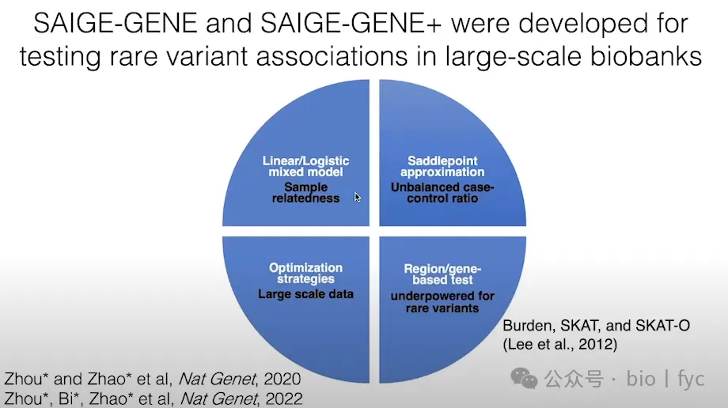
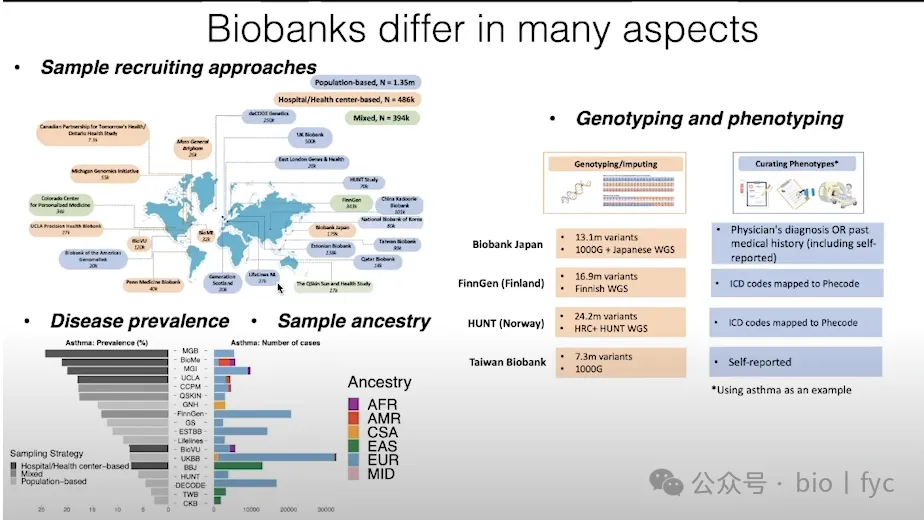

# PheWAS学习笔记

MPG Primer: PheWAS, UKBB (2024):https://www.youtube.com/watch?v=4evyahwyRNM&t=1s

**biobank关联研究中的问题：样本间相关性高，常规线性模型不合适**

**已有的一些线性模型**

**如果用线性模型针对某一研究曼哈顿图如下:**

**换个混合模型**

**但是又不适合大数据**

**因此第二个挑战是大数据**

**第三个挑战是严重的case-control样本数量不均衡**

**解决办法：新算法**

**示例结果如下，是不是已经不那么乱了**

**更多的例子**

**来多个算法比较一下：SAIGE很优秀啊**

**好的模型算法越来越多**

**其实队列研究的一个主要方向还有：rare variant**

**因此针对队列研究的总体需求汇总如下**

**专门针对rare variant的关联研究工具**

**然后汇总一下上面所说的，针对数量性状模型选择**

**针对质量性状模型选择**

**最后关于biobank联盟**

**还有一个，这个全称是看名字应该就知道啥意思：BRaVa:BiobankRareVariant Analysis**

single-variant association and Collapsing rare variants